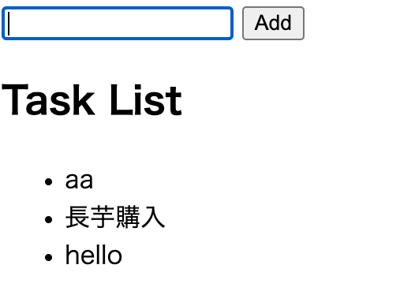

# serverless-web-app-sandbox

Todo application




## Usage


```
# install
npm run i

# deploy
npm run deploy
```


# Endpoints

see [serverless.yml](serverless.yml)

```text
# S3
static/index.html


# Lambda
src/hello.js
src/taskHandler.js
```


